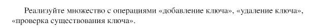
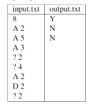

### Задание №1: Множество
## Вариант 7   
 
## Задание   

 
## Input / Output   

## Ограничения по времени и памяти   
 
- Ограничение по времени: 2 сек.   
- Ограничение по памяти: 256 МБ.   
 
## Запуск проекта   
 
1. Клонируйте репозиторий:   
   
bash   
   git clone https://github.com/username/repository-name.git   
   
   
 
2. Перейдите в папку с проектом:   
   
bash   
   cd repository-name/lab6/task4   
   
   
 
3. Запустите программу:   
   
bash   
   python src/main.py   
   
   
 
4. Для запуска тестов выполните:   
   
bash   
   pytest tests/   
   
   
 
--- 