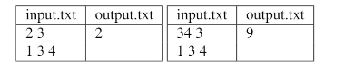

### Задание №1: Обмен монет
## Вариант 7

## Задание
Применить динамическое программирование для решения задачи про обмен монет для разных наминалов

## Input / Output

## Ограничения по времени и памяти

- Ограничение по времени: 1 сек.

## Запуск проекта

1. Клонируйте репозиторий:

bash
   git clone https://github.com/username/repository-name.git

2. Перейдите в папку с проектом:

bash
   cd repository-name/lab6/task4

3. Запустите программу:

bash
   python src/main.py

4. Для запуска тестов выполните:

bash
   pytest tests/

---