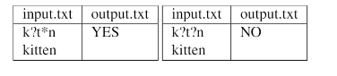

### Задание №7: Шаблоны 
## Вариант 7

## Задание
Реализовать простейший алгоритм проверки шаблонов для имен файлов 
## Input / Output

## Ограничения по времени и памяти

- Ограничение по времени: 2 сек.
- Ограничение по времени: 256 мб.

## Запуск проекта

1. Клонируйте репозиторий:

bash
   git clone https://github.com/username/repository-name.git

2. Перейдите в папку с проектом:

bash
   cd repository-name/lab6/task4

3. Запустите программу:

bash
   python src/main.py

4. Для запуска тестов выполните:

bash
   pytest tests/

---